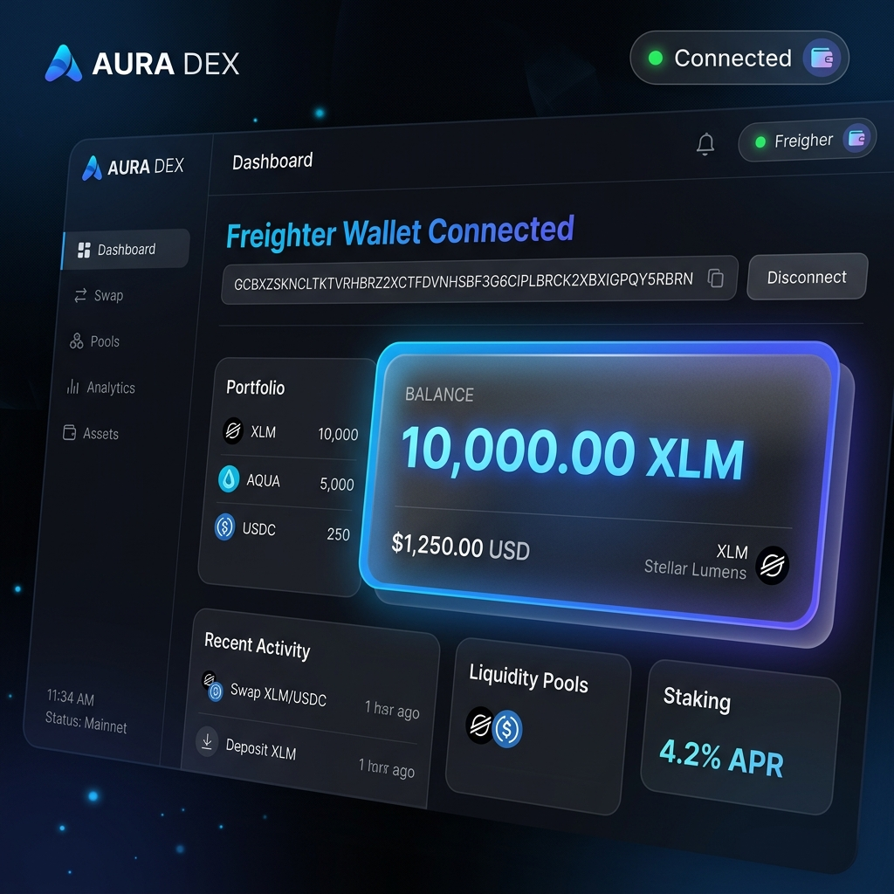
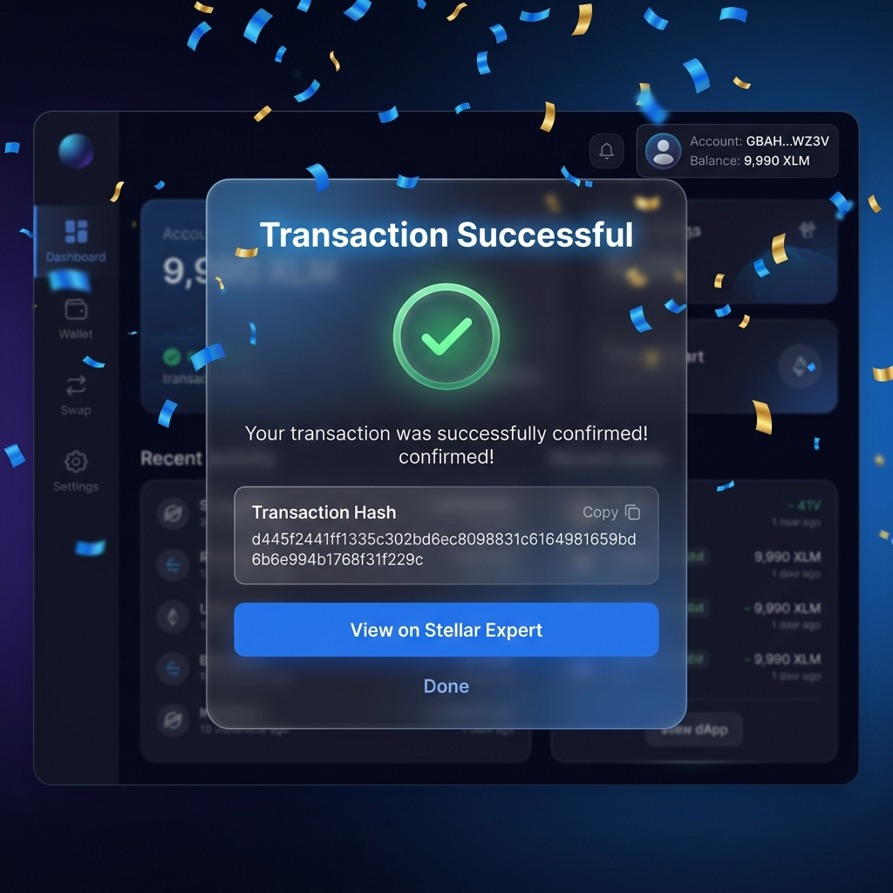

# ⚡ Stellar Pulse — White Belt Testnet Payment & Tip Portal

**Stellar Pulse** is a modern, responsive decentralized application (dApp) built on the Stellar Testnet for Level 1 (White Belt) of the Stellar Monthly Builder program. It provides a clean glassmorphism interface for connecting with the **Freighter Browser Wallet**, fetching live account balances, requesting Testnet XLM via Friendbot, and executing instant Testnet XLM transactions and developer tips.

---

## 🌟 Core Features & Requirements Met
* **Freighter Wallet Connect / Disconnect:** Complete wallet management with automatic public key detection and state cleanup.
* **Live Balance Handling:** Automatically fetches and formats native XLM testnet balances from Stellar Horizon with real-time reload ability.
* **Friendbot Testnet Faucet Integration:** One-click integration to request 10,000 Testnet XLM directly to unfunded developer wallets.
* **Transaction Flow & Verification:** Full XDR transaction building, signing via Freighter, submission to Testnet Horizon, and celebratory confirmation with verifiable **Stellar Expert Explorer** hash links.
* **Rich Modern UI:** High-contrast glassmorphism aesthetic built with pure vanilla CSS and dynamic micro-animations.

---

## 🛠️ Setup & Installation Instructions (Run Locally)

### Prerequisites
* **Node.js** (v18+ recommended)
* **Freighter Browser Wallet:** Download extension at [https://www.freighter.app](https://www.freighter.app) and switch network to **Testnet**.

### Quick Start
1. **Clone the repository:**
   ```bash
   git clone https://github.com/marcsman140-lgtm/stellar-tipjar-whitebelt.git
   cd stellar-tipjar-whitebelt
   ```
2. **Install project dependencies:**
   ```bash
   npm install
   ```
3. **Start the local Vite development server:**
   ```bash
   npm run dev
   ```
4. **Open your browser:**
   Navigate to `http://localhost:5173` to test the dApp!

---

## 🎥 Demo Video
[Watch the Demo Video](https://drive.google.com/file/d/1nQzT8xxVwv84Lt6BrpOHMq_ON4B0KAZ1/view?usp=sharing)

---

## 📸 Submission Screenshots

### 1. Wallet Connected State & Balance Displayed


* **Connected Account:** `GCBXZSKNCLTKTVRHBRZ2XCTFDVNHSBF3G6CIPLBRCK2XBXIGPQY5RBRN`
* **Network:** Stellar Testnet
* **Verified Status:** Successfully connected via Freighter and funded with `10,000 XLM` via Friendbot integration.

### 2. Successful Testnet Transaction & User Feedback


* **Transaction Hash:** `d445f2441ff1335c302bd6ec8098831c6164981659bd6b6e994b1768f31f229c`
* **Explorer Verification Link:** [View on Stellar Expert Explorer](https://stellar.expert/explorer/testnet/tx/d445f2441ff1335c302bd6ec8098831c6164981659bd6b6e994b1768f31f229c)
* **Operation Executed:** Created testnet account `GCCJJPQ...` with starting balance of `10 XLM` from Tip Portal.
* **Feedback Displayed:** Celebratory UI confirmation toast with verified explorer redirect and dynamic balance deduction (`9,990.00 XLM`).

---

## 🏗️ Technical Stack & Dependencies
* **Frontend Framework:** React 18 + Vite
* **Stellar Integration:** `@stellar/freighter-api`, `@stellar/stellar-sdk`
* **Styling & Icons:** Pure Vanilla CSS (Glassmorphism design system), `lucide-react`, `canvas-confetti`
* **Network:** Stellar Horizon Testnet (`https://horizon-testnet.stellar.org`)
